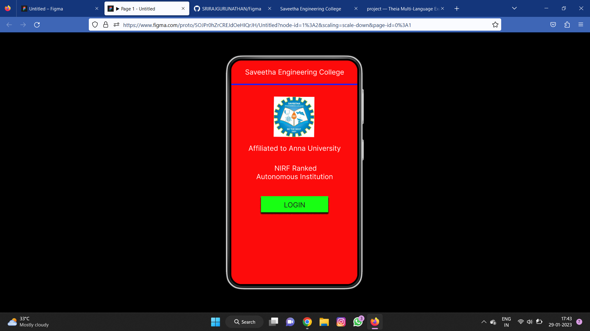
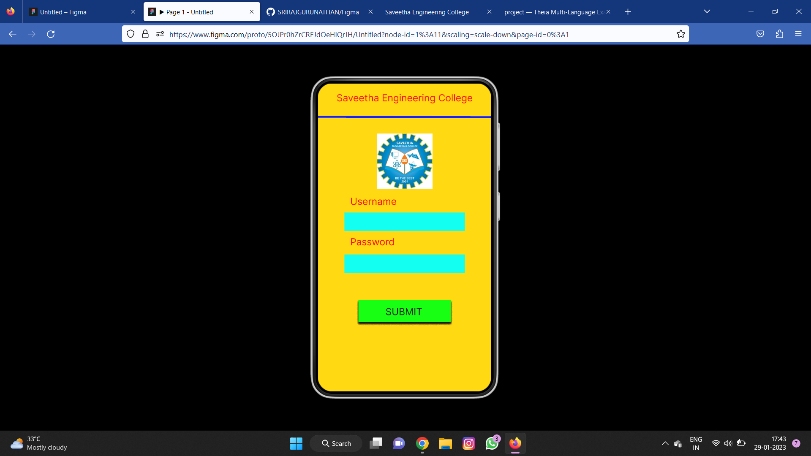
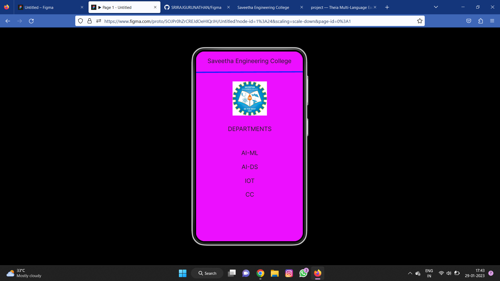

# Event Registration Web Application

## AIM:
To design, develop and deploy a web application for event registration.

## DESIGN STEPS:

### Step 1:
Create a new frame.

### Step 2:
Select any one preset size of your choice.

### Step 3:
Select the shapes you need.

### Step 4:
Import images as needed.

### Step 5:
Create pages based on your need and link them.

### Step 6:

Validate the HTML and CSS code.

### Step 6:

Publish the website in the given URL.

## DESIGN TOOL:
Figma

## CODE:
```
/* Home Page */
position: relative;
width: 430px;
height: 932px;
background: #B0A9A9;

/* login page */
position: relative;
width: 430px;
height: 932px;
background: #7E0A0A;

/* Saveetha Engineering College */
position: absolute;
width: 387px;
height: 48px;
left: 26px;
top: 62px;
font-family: 'Inter';
font-style: normal;
font-weight: 400;
font-size: 26px;
line-height: 31px;
text-align: center;
color: #051070;

/* DEPARTMENTS */
position: absolute;
width: 387px;
height: 71px;
left: 21px;
top: 371px;
font-family: 'Inter';
font-style: normal;
font-weight: 400;
font-size: 28px;
line-height: 34px;
text-align: center;
color: #971C1C;

/* AI-ML */
position: absolute;
width: 387px;
height: 71px;
left: 21px;
top: 471px;
font-family: 'Inter';
font-style: normal;
font-weight: 400;
font-size: 28px;
line-height: 34px;
text-align: center;
color: #971C1C;

/* AI-DS */
position: absolute;
width: 387px;
height: 71px;
left: 21px;
top: 542px;
font-family: 'Inter';
font-style: normal;
font-weight: 400;
font-size: 28px;
line-height: 34px;
text-align: center;
color: #971C1C;

/* IOT */
position: absolute;
width: 387px;
height: 71px;
left: 21px;
top: 624px;
font-family: 'Inter';
font-style: normal;
font-weight: 400;
font-size: 28px;
line-height: 34px;
text-align: center;
color: #971C1C;

/* CSE */
position: absolute;
width: 387px;
height: 71px;
left: 21px;
top: 695px;
font-family: 'Inter';
font-style: normal;
font-weight: 400;
font-size: 28px;
line-height: 34px;
text-align: center;
color: #971C1C;

/* Line 3 */
position: absolute;
width: 440px;
height: 0px;
left: 0px;
top: 100px;
border: 4px solid #E9E2FD;

/* logo sec 4 */
position: absolute;
width: 220px;
height: 231px;
left: 105px;
top: 129px;
background: url(logo sec.png);
```
## OUTPUT:




## RESULT:
The program to design, develop and deploy a web application for event registration is completed successfully.